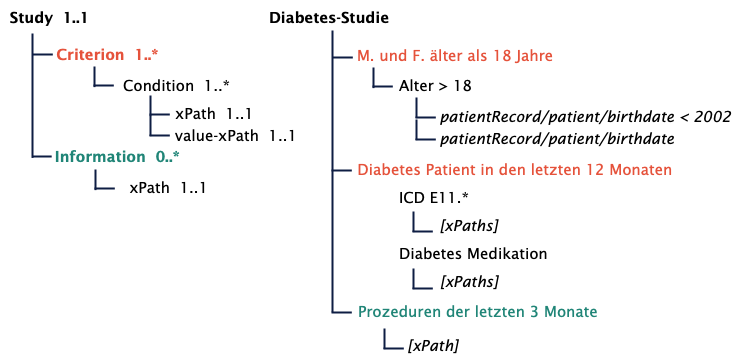
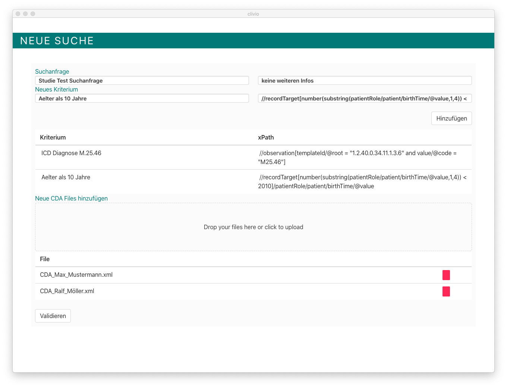
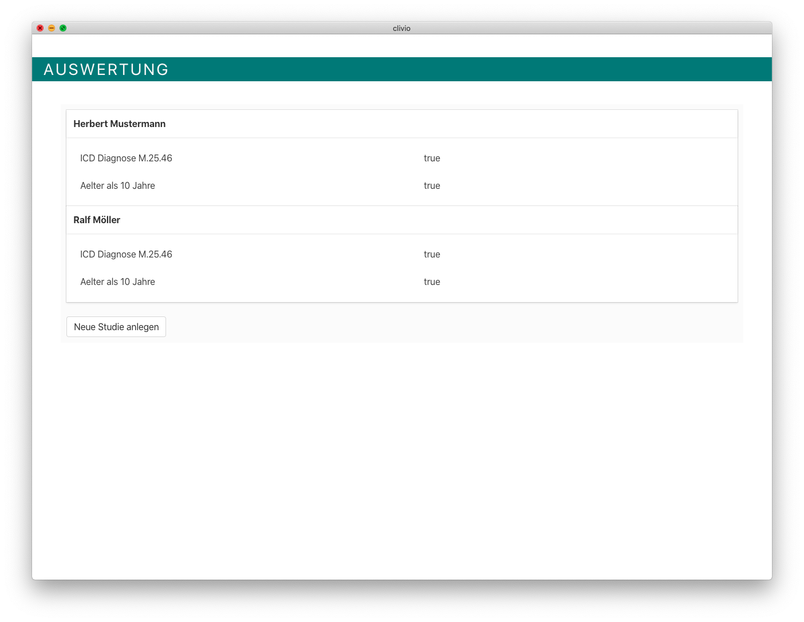
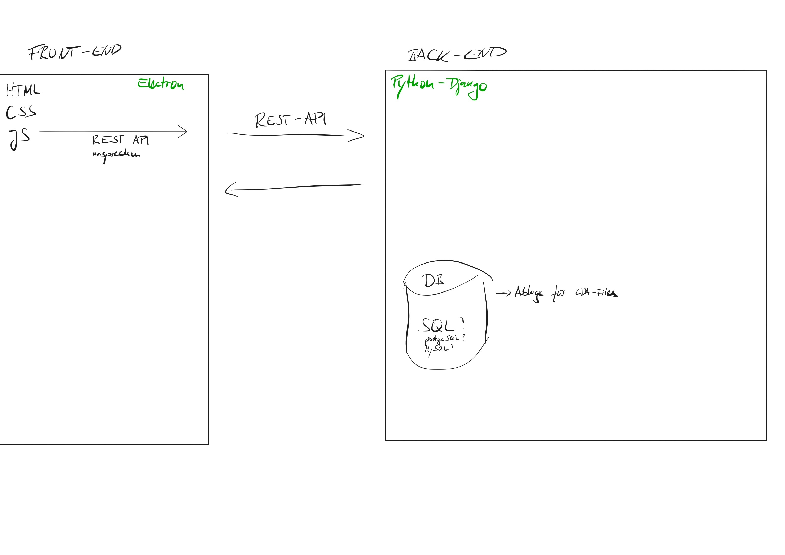

# RecruitmentTool (Master Thesis by Raik Mueller) 
## Semiautomatische Rekrutierung von Studienpatienten unter Nutzung von ELGA-Daten: Konzeptionierung und prototypische Implementierung eines IT-Tools

## Zeitplan

#### 30.09.2020 Fertigstellung Prototype V.1 (Konzepte/Mockups wurden grundsätzlich umgesetzt)
##### Funktionalitäten für V.1
- ✓ xPath "Algorithmus"  
- ✓ Evaluations-Page (Auswertung der Patienten/-innen)
- ✓ Detail-Ansicht von ausgewerteten Bedinungen (inkl. CDA Visualisierung)
- ✓ XDS Anbindung (eHC und IPF Framework)
##### Funktionalitäten für V.2 (bis Dezember)
- Export-Möglichkeiten von selektierten Patienten/-innen
- Studienverwaltung (z.B. Änderungen von xPaths bzw. Bedingungen)
#### 1.10.2020 - 7.10.2020: Testing mit echten Daten, Evaluierung und Fehlverhalten finden und ausbessern (→ V.2)
#### 01.11.2020 Masterarbeit V.1
#### 01.12.2020 Abgabe der Masterarbeit und Prototyp V.2

---

#### [🎯 Kanban Board Backend Software](https://github.com/raikm/RecruitmentTool/projects/2)

#### [Backend Repository (Private)](https://github.com/raikm/RecruitmentTool_Backend)

#### [eHC Repository](https://github.com/raikm/eHealthConnectorMiniAPI)

#### [🎯 Kanban Board Frontend Software](https://github.com/raikm/RecruitmentTool/projects/3)

# 🏗Timeline Progress

## 1.11.2010 - 30.11.2020: Fokus auf schriflichen Teil + Doku

Ausblick

<ul>
  <li>schriftlicher Teil bis Diskussion fertig</li>
  <li>Doku Architektur</li>

</ul>
<ul>
   <li>Doku im Code</li>
   <li>Bugfixes</li>
</ul>

## 01.10.2020 - 31.10.2020: Fokus auf schriftlichen Teil und Prototype V.1

- Grober Text-Entwurf für Masterarbeit bis Diskussion steht
- Mockup finale Version für Prototypen

### Software
#### NEW
- Patienten/-innen Vorauswahl
- Auswahl zwischen Lokaler oder XDS Auswahl
- Sortierung von EK und AK
- Speichern von ausgewählten personen

#### IMPROVE / CHANGE
- BE: Lokale Datenverarbeitung mit Cache
- FE: bessere Darstellung für vorhandene CDA Dokumente

## 01.09.2020 - 30.09.2020: Fokus auf Prototype V.1

- Alle xPaths für Studie A und B sind für die ersten Versuche finalisiert (WIP)
- erster Entwurf für Inhaltsverzeichnis steht
- Mockup Updates

### Software
#### NEW
- BE: eHC Integration (Java): Upload & Download von CDA Files
- BE: erweitert mit eHealthConnector (Python Django)
- BE: Testdaten Upload Funktionalität
- BE: neue Regel bei positiven und negativen Ergebnissen
- FE: PopUp für Bedinungen-Details
- FE: Visualisierung von CDA Dokumente

#### IMPROVE / CHANGE
- BE: Response + DB Anpassung für neg. xPaths
- FE: EvaluationsPage nach Mockup
- FE: Neue Studie anlegen angepasst für neg. xPaths

## 01.08.2020 - 31.08.2020: 6. Monat
- Alle xPaths für Studie A und B sind für den ersten Versuch vorbereitet (WIP)
- Finalisierung der Funktionalitäten für Prototypen (siehe Zeitplan)
- Anpassung der Mockups

### Software
- Erste Versuche für XML Visualisierung (WIP)

#### NEW
- Erster Prototype für Evaluierung (nach Mockup)
- Detailansicht für Bedingungen (PopUp)

#### IMPROVE / CHANGE
- JSON Antwort
- neue Aufteilung der xPath-Auswertung (Positiv, Negativ, ...)

## 01.07.2020 - 31.07.2020: 5. Monat

- Auswertung von Experterninterviews --> Ergänzung der Mockups
- Experteninterviews abgeschllossen
- Mini Evaluierung vorbereitet (Feedback von Ärzten über neue Mockups einholen)
- Fertigstellung Mockups V.2
- WIP xPaths für Kl. Studien

### Software
- Weiterentwicklung an Auswertungssformular
- Recherche für CDA2PDF Integration

#### NEW
- XDS Repository auf MedUni Server

#### IMPROVE / CHANGE
- Beginn mit eHealth Connector
- JSON Antwort

## 01.06.2020 - 30.06.2020: 4. Monat

- Auswertung von Experterninterviews
- Zusammenfassung der möglichen Studien
- Mockups nach Auswertung angepasst
- neue Aufbau der Baumstruktur von Kl. Studien (technischer Aufbau):

### Software
- Testumgebung in MedUni Wien eingerichtet
#### NEW
- Dashboard über aktuelle Studien
- Unterscheidung von Editor und Validierungsmodul für Ersteller und Anwender
- Unterstützung für die Suche nach Informationsbedürfnisse

#### IMPROVE / CHANGE
- xPath Gruppierung (Condition + Value Abfrage)
- Datenbankstruktur
- weitere ELGA-Testdaten getestet

## 01.05.2020 - 31.05.2020: RA-Analyse

- Fertigstellung der RA-Analyse -> im Juni Auswertung

### Software
#### NEW
- nur XML Files werden akzeptiert
- UnitTests
#### IMPROVE / CHANGE
- Verbesserung der Robustheit bei der xPath Auswertung: wenn Wert nicht gefunden wird, dann Prüfung, ob überhaupt Wert enthalten ist

## 01.04.2020 - 30.04.2020: Fertigstellung von v 0.1
- Fertigstellung von v0.1 für die Auswertung von einem Pool von CDA Dokumenten
- Daten (Name, IDs,...) auslesen aus CDA Dateien
- Umstellung auf Vue.js für Front-End
    - erstes Basic Design
- Basic Auswertung der CDA Files im Front-End
- Testing CDA Libraries (SAXCON, ETREE)
- Erstellung Konzept für Datenhaltung
- Verbesserung der Datenhaltung

#### Screenshots Version 0.1

## 03.03.2020 - 31.03.2020: Kickoff
- Konzept für Requierments Analyse recherchiert
  - [Erstes Konzept erstellt](https://www.notion.so/Konzept-a88d0a9f79ec4122bc6533d7d3cdb702)
  
- erstes Protyping testing mit Python für Auswertung von CDA Dokumenten mit Hilfe von XPaths
    - noch fehleranfällig mit den gegebenen xPaths
- Basic Electron App (Front-End) mit Basic REST-Interaktionen
- Basic Django Server (Back-End) mit Basic REST-Interaktionen
    - ermöglicht auch Speicherung von xml Dateien auf dem Server zur Ablage und weiteren Verarbeitung

#### Erster Entwurf für Front und Back-End:

